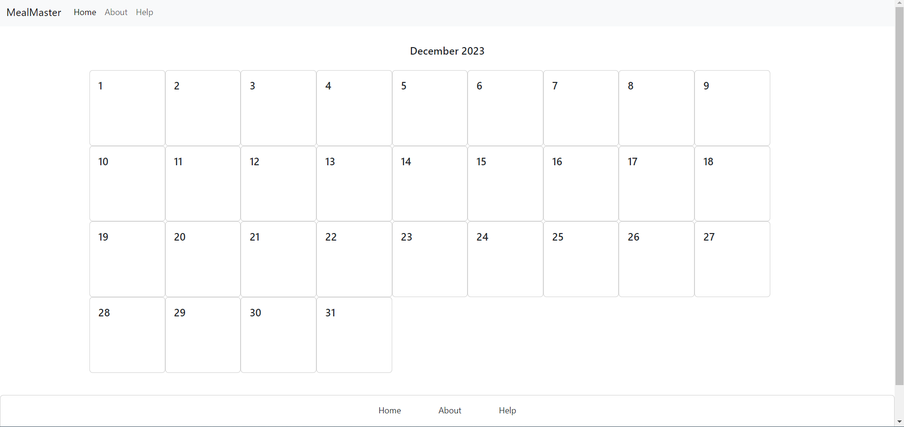
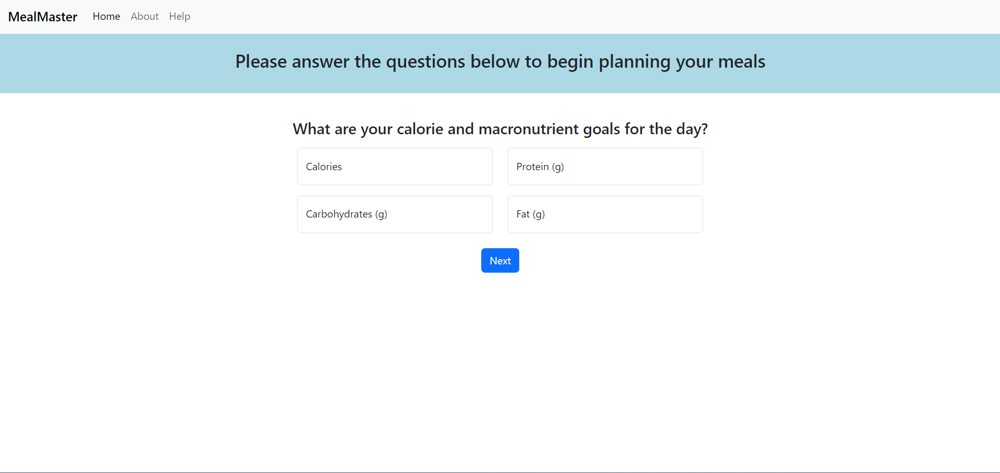
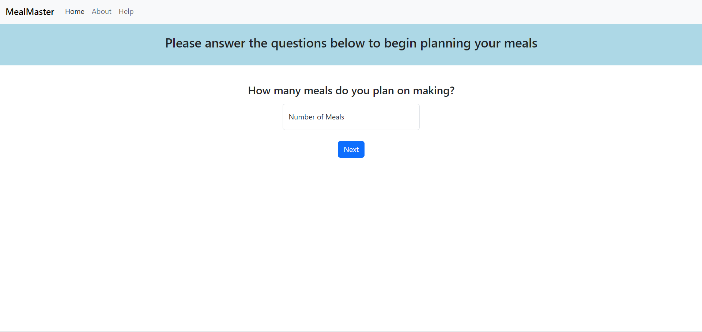
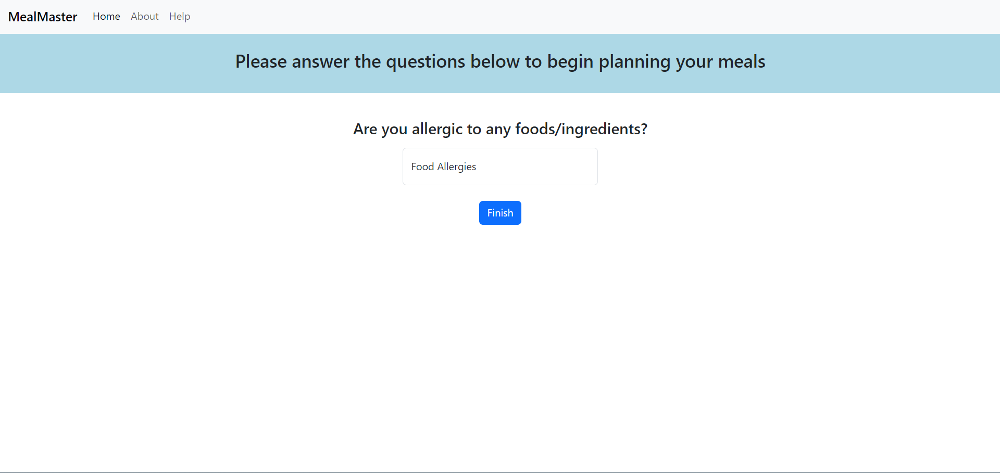
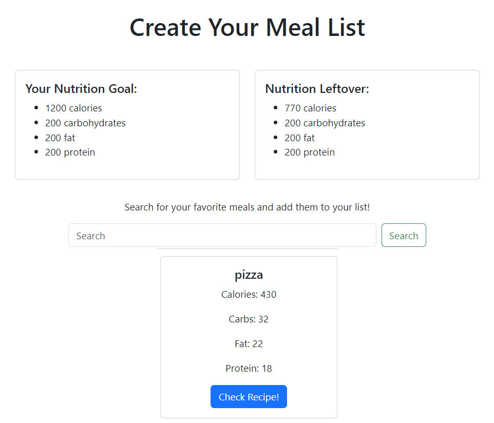
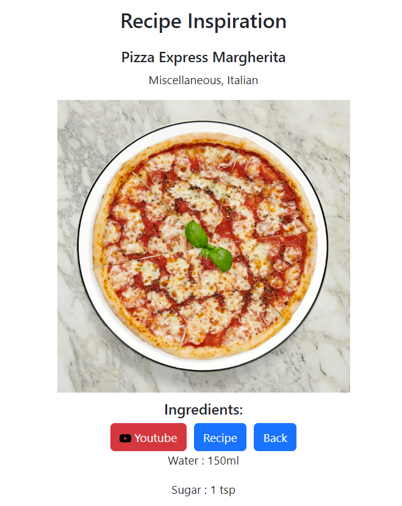
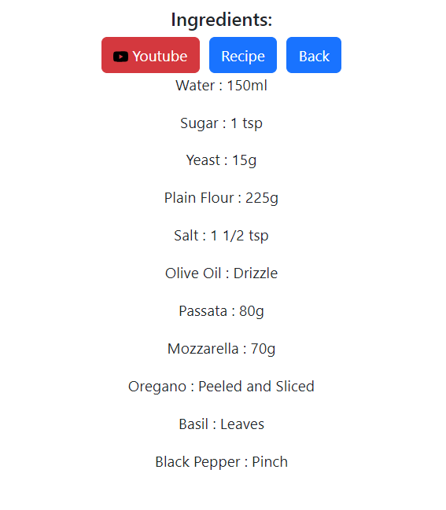

# MealMaster

MealMaster is a responsive web application to help with all your nutritional needs.

## Description

The MealMaster web application aims to help users live a healthy, balanced lifestyle by assisting them in meeting their nutritional needs.

- As a User,
- I want to be able to identify the calories in ingredients and search for recipes,
- So that I can plan meals in advance and stick to my macro requirements.

MealMaster allows the user to select a specific date on a calendar and then calculate and identify their nutritional goals for that day through an interactive quiz.

The user can then search for ingredients and recipes to prepare for the days and weeks ahead. MealMaster allows the user to record nutritional information, giving feedback on the remaining nutritional allowances for the day.

Information is stored in the user's browser storage, allowing them to easily monitor progress on return to the application.

## Technologies 

 - HTML/CSS
 - Bootstrap
 - JavaScript
 - JQuery
 - DayJS
 - <a href="https://spoonacular.com/food-api">Spoonacular API</a>
 - <a href="https://www.themealdb.com/api.php">TheMealDB API</a>

## Images of Deployed Site

### Home/Calendar Page: 

### Quiz Page: 

### Meal List Page: 

### Meal View Page: 

## Installation

No installation steps are needed to access MealMaster.

## Usage

The MealMaster web app can be accessed directly from your browser through the following <a href="https://4codecrushers.github.io/mealMaster/">link</a>.

## Credits

- Ewelina Sobora: <a href="https://github.com/ewelinasobora">Github</a>
- Lucy Bonfield: <a href="https://github.com/lucybonfield">Github</a>
- Dominic Brown: <a href="https://github.com/dombrown95">Github</a>
- Tom Paling: <a href="https://github.com/ph8tfunk">Github</a>

## License
MIT license
